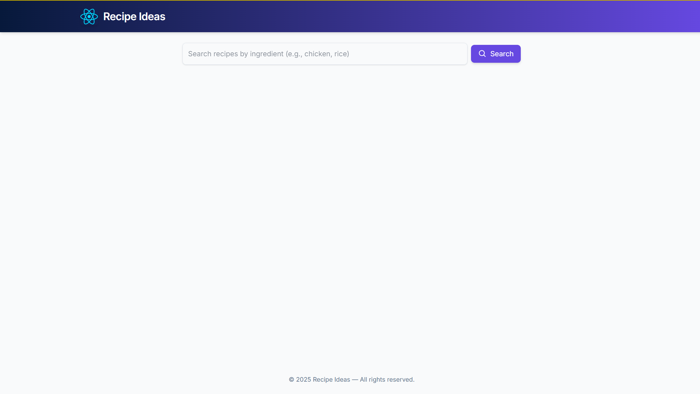
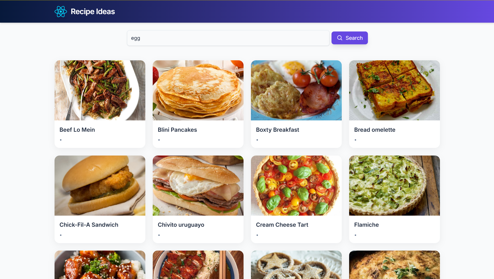
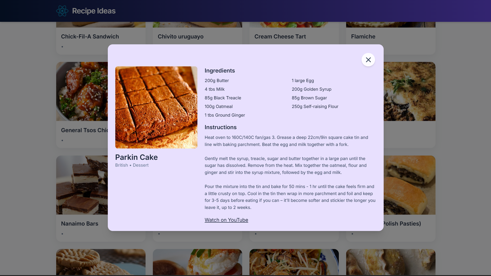

# 🧁 Recipe Ideas App

A modern **React-based recipe finder** that allows users to search for recipes by ingredient, view detailed instructions, and explore dishes with beautiful animations and a responsive design.  
Built using **React.js**, **Tailwind CSS**, and **TheMealDB API**.

---

## 🚀 Live Demo 
🔗 https://r969m9-5173.csb.app/

---

## 🧩 Features

✅ **Search by Ingredient** — Instantly find recipes based on any ingredient (e.g., chicken, rice, egg).  
✅ **Responsive UI** — Works smoothly on desktop, tablet, and mobile devices.  
✅ **Animated Cards & Modals** — Built with smooth AOS (Animate On Scroll) transitions.  
✅ **Recipe Details Modal** — Displays ingredients, instructions, and YouTube video links.  
✅ **Debounced Search** — Prevents unnecessary API calls while typing.  
✅ **Custom Loader Animation** — Elegant spinning logo while fetching data.  

---

## 🛠️ Tech Stack

| Category | Technology |
|-----------|-------------|
| Frontend | React.js (Vite) |
| Styling | Tailwind CSS |
| Animations | AOS (Animate On Scroll) |
| API | TheMealDB Public API |
| Icons | React Icons |
| Package Manager | npm or yarn |

---

## 📁 Folder Structure

```
📦 recipe-ideas-app
 ┣ 📂 src
 ┃ ┣ 📂 assets
 ┃ ┣ 📂 components
 ┃ ┃ ┣ Header.jsx
 ┃ ┃ ┣ SearchBar.jsx
 ┃ ┃ ┣ RecipeList.jsx
 ┃ ┃ ┣ RecipeCard.jsx
 ┃ ┃ ┣ RecipeModal.jsx
 ┃ ┃ ┗ Loader.jsx
 ┃ ┣ 📂 utils
 ┃ ┃ ┗ format.js
 ┃ ┣ App.jsx
 ┃ ┣ api.js
 ┃ ┣ index.css
 ┃ ┗ main.jsx
 ┣ 📜 package.json
 ┣ 📜 vite.config.js
 ┗ 📜 README.md
```

---

## ⚙️ Installation and Setup

1️⃣ **Clone the repository**
```bash
git clone https://github.com/KavinM004/recipe-ideas.git
```

2️⃣ **Navigate into the project**
```bash
cd recipe-ideas
```

3️⃣ **Install dependencies**
```bash
npm install
```

4️⃣ **Run the development server**
```bash
npm run dev
```

5️⃣ **Open in browser**
```
http://localhost:5173/
```

---

## 🌐 API Reference

Data is fetched from **TheMealDB** public API:  
🔗 https://www.themealdb.com/api.php

Endpoints used:
- Search by Ingredient: `/filter.php?i={ingredient}`
- Get Meal by ID: `/lookup.php?i={id}`

---

## 💅 Styling and Animations

- **Tailwind CSS** is used for responsive design.  
- **Custom Animations:**  
  - `fadeIn`, `fadeUp`, and `float-card` keyframes in `index.css`.  
- **AOS Library:** Handles scroll-triggered fade/slide effects.

---

## 🧠 Key Files

| File | Purpose |
|------|----------|
| `App.jsx` | Main app container; handles state, search, and modal logic |
| `api.js` | API utility for fetching meals |
| `RecipeCard.jsx` | Displays individual recipe cards |
| `RecipeModal.jsx` | Shows detailed recipe info |
| `Loader.jsx` | Custom animated loading spinner |
| `format.js` | Extracts ingredients and measures from API data |

---

## 🧾 Deployment

You can deploy the app easily using:
- **Netlify**
- **Vercel**
- **Render (Static Site)**

Build command:
```bash
npm run build
```

Deploy the `/dist` folder generated after build.

## Level 2 – Working Application
Deployed on CodeSandbox:  
🔗 [Live Demo](https://r969m9-5173.csb.app/)

## Level 1 – ChatGPT Work
🔗 [ChatGPT Discussion Link](https://docs.google.com/document/d/1eDJ4FH2bvHzIuHF8jQofJtwOX-I4U_JWtAqHPCn1CkE/edit?usp=sharing)

---

🎥 Video Demonstration
🔗 https://drive.google.com/file/d/1bruEJkqadOuagouMfpV3NBqTI6TIGcdU/view?usp=sharing


## 📸 Screenshots 

- 🏠 **Home Page**
          
- 🔍 **Search Results**
          
- 🍽️ **Recipe Details Modal**
          
---

## 👨‍💻 Author

**Kavin M**  
Frontend Developer | React.js & Node.js Enthusiast  
📧 karthickkavin004@gmail.com  
📱 +91 63691 55656  


